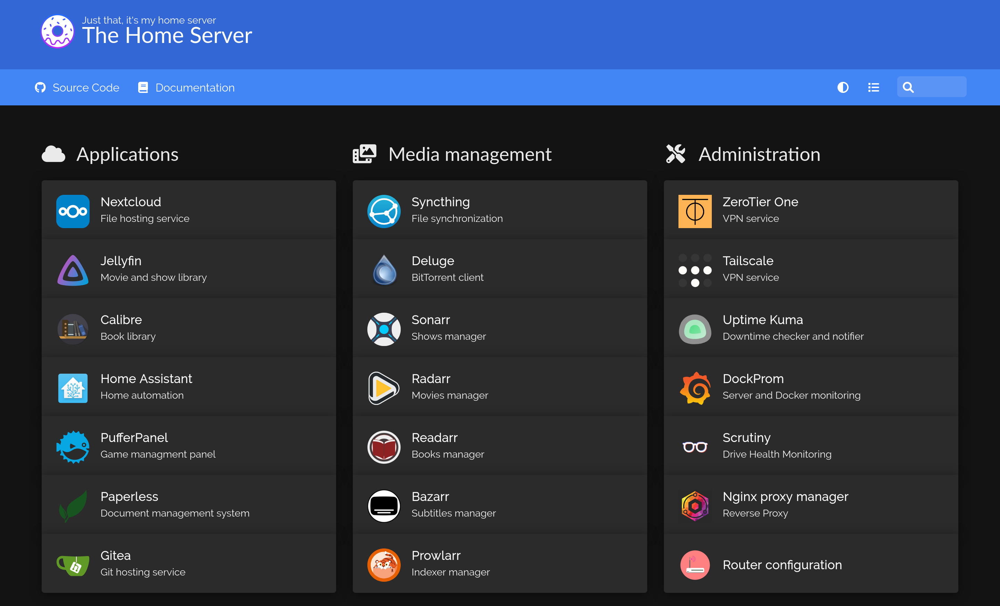

<h1 align="center">
	HomeServer with Ansible
</h1>

  

This repository contains the Ansible playbooks I use for managing my home server.

As it is for personal use, features can be added, modified or deleted on master upon personal preference, beware of pulling.

## Playbook structure

The services present in this repository are hosted in two machines:

- **TorreServer**: Toshiba Satellite Pro
- **HomeServer**: Lenovo Thinkcentre M900 Tiny

For development reasons, there are three different playbooks:

- `main.yml`: Tasks for both machines, also calls to the two playbooks below
- `homeserver.yml`: Tasks for the HomeServer machine
- `torreserver.yml`: Tasks for the TorreServer machine

Inside the latter two, one can easily see which services are hosted into each machine.

## Installation

This repository (as well as other Ansible playbooks) requires Ansible installed on the Control Node. It is widely available in package managers.

#### Requirements and inventory

Inside the cloned repo, install the Ansible requirements on the control node with:

	ansible-galaxy install -r requirements.yml

Now, modify the hosts file to reflect your machines' information.

#### Variables and secrets

Variables used by Ansible are defined in `group_vars/<group>` and `roles/<role_name>/vars/main` (although not all roles have variables). After cloning the repo, only a few values will show up, as most of them are protected using *ansible_vault*.

To avoid making you create all these variables yourself, the needed templates are provided in `group_vars/<group>_secret_base.yml` and `roles/<role_name>/vars/secret_base.yml`. These files are ignored by Ansible. Use the command

	make create_secret

to automatically generate a copy of each template into the corresponding `secret.yml` file, which will be processed by Ansible. Now you can populate all variables with your data.

To encrypt and decrypt this data using *ansible-vault*, you will also need a file called `vault_file` containing the vault password. This functionality can be changed inside `ansible.cfg`.

Finally, in order to encrypt and decrypt all the secret files, you can use:

	make encrypt_secret
	make decrypt_secret

## Usage

With the installation completed, you just have to run one of the three playbooks, depending on which machines you want to configure:

	ansible-playbook PLAYBOOK

For convenience, some common services can be run through a Makefile. All available targets can be checked with:

	make list

## Documentation

I use a private documentation repository (the *mkdocs* role) where I dive deeper into some manual configuration and troubleshooting for each service, but also mixed with personal data, so I cannot make it public for now.

For any doubt with a certain container, first refer to its documentation on Dockerhub.

## Contact

For any doubt or suggestion, don't hesitate to [contact me](mailto:albertcanalesros@gmail.com), I will be glad to help! 
